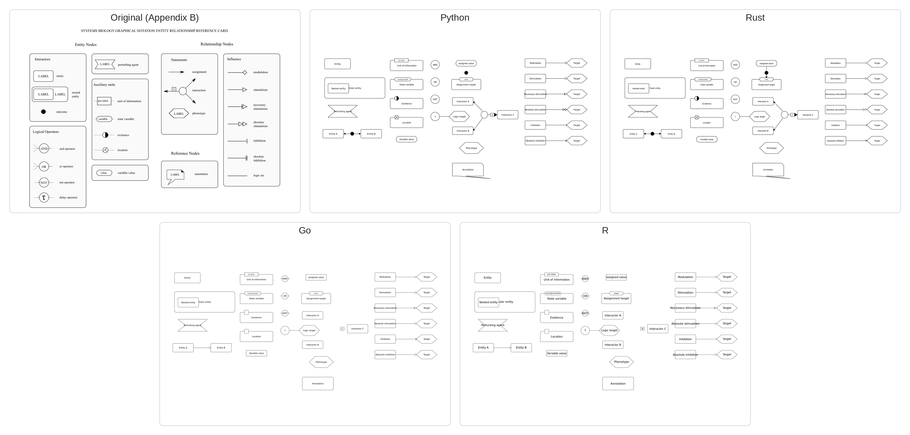

# render_er

A native Rust renderer for SBGN Entity Relationship (ER) Level 1 maps. It reads
SBGN-ML and writes PNG or SVG without requiring a browser or a host graphics
library. It also provides a source-faithful SVG-to-PNG path used to reproduce
every figure in the ER Level 1 specification while retaining source colors.

The rendering engine is adapted from the MIT-licensed Rust implementation in
[`cannin/render_sbgn`](https://github.com/cannin/render_sbgn). ER parsing and
rendering support in this repository includes arc groups, nested entities,
outcomes attached to statement arcs, arc ports, bend points, and every ER Level
1 influence marker.

## Quick start

```bash
cargo run --release -- draw_sbgnml \
  --input-path examples/figure_1_1.sbgn \
  --output-path output/figure_1_1.svg
```

Use `.png` as the output extension for raster output. When `--output-path` is
omitted, both formats are written beside the input file. Run
`cargo run -- --help` for all sizing and styling options.

## Complete specification figure set

Render all 68 numbered figures and the Appendix B reference card from the
official `sbgn/entity-relationships` sources:

```bash
uv run python scripts/render_all_figures.py
```

The script clones the source repository into `tmp/` when needed, converts its
three PDF-only assets to SVG, builds the Rust renderer, and sends all 69 figures
through `render_er draw_svg`. Original red, blue, amber, and other source colors
are preserved. Results are written to:

- `output/all_figures/png/` — tightly cropped PNG renderings
- `output/all_figures/svg/` — original or PDF-converted SVG sources
- `output/all_figures/index.html` — browsable figure gallery
- `output/all_figures/manifest.csv` — figure-to-source mapping and color report
- `output/all_figures/contact_sheets/` — six visual QA overviews

The complete figure mapping and validation notes are in
[`docs/all_figures.md`](docs/all_figures.md).

Render one source SVG directly with Rust:

```bash
cargo run --release -- draw_svg \
  --input-path figure.svg \
  --output-path figure.png \
  --scale 2
```

## Supported ER notation

- Interactors: entity, nested entity, outcome, and perturbing agent
- Logical operators: and, or, not, and delay
- Statements: assignment, binary or n-ary interaction, and phenotype
- Auxiliary units: unit of information, state variable, variable value,
  existence, location, and cardinality
- Influences: modulation, stimulation, necessary stimulation, absolute
  stimulation, inhibition, absolute inhibition, and logic arc
- Annotation callouts

## SBGN-ML compatibility

No private XML vocabulary is needed. LibSBGN milestone 3 (`0.3`) already defines
all ER Level 1 Version 2 glyph and arc classes, including `variable value`,
`delay`, `existence`, `location`, and the absolute influence classes. Both of
these map declarations are accepted:

```xml
<map language="entity relationship" id="map1">
```

```xml
<map version="http://identifiers.org/combine.specifications/sbgn.er.level-1.version-2"
     id="map1">
```

An explicit non-ER `language` is rejected. Namespace-qualified SBGN-ML 0.2 and
0.3 files are parsed by local element name.

## Examples and visual comparison

- `render_examples/er_all_glyphs.sbgn` exercises every ER Level 1 reference-card
  glyph and arc class in one schema-valid diagram. Its 23-of-23 coverage table
  is in [`docs/er_all_glyphs_coverage.md`](docs/er_all_glyphs_coverage.md).
- `figure_1_1.sbgn` reconstructs the introductory assignment-stimulates-
  interaction diagram.
- `figure_a9_pcr.sbgn` corresponds to PDF Figure A.9.
- `figure_a10_camkii.sbgn` corresponds to PDF Figure A.10.
- `reference_card.sbgn` exercises the full ER symbol vocabulary.
- `nested_entity.sbgn` demonstrates recursive entity containment.

Rendered PNG and SVG files are in `output/`. The comparison method and results
for hand-authored SBGN-ML examples are documented in
[`docs/visual_comparison.md`](docs/visual_comparison.md). The separate complete
catalog uses the exact figure assets referenced by the specification's TeX
source; only `examples/rtk.sbgn` is supplied upstream as structured SBGN-ML.

## Cross-language renders

The Go, R, and Python renderer baselines imported from `render_sbgn` remain
independent implementations alongside the native Rust renderer. Generate PNG
and SVG versions of the ER all-glyphs fixture with all four languages:

```bash
./scripts/render_language_examples.py
```

The results are written below `output/languages/{rust,go,r,python}/`. Python
uses the same `pycairo` dependency as `render_sbgn`; R uses the upstream base-R
graphics implementation and therefore does not require the R Cairo package.



## Verification

```bash
cargo fmt -- --check
cargo clippy --all-targets --all-features -- -D warnings
cargo test
```

To validate an example against the official LibSBGN schema:

```bash
xmllint --noout --schema /path/to/libsbgn/resources/SBGN.xsd \
  examples/reference_card.sbgn
```
